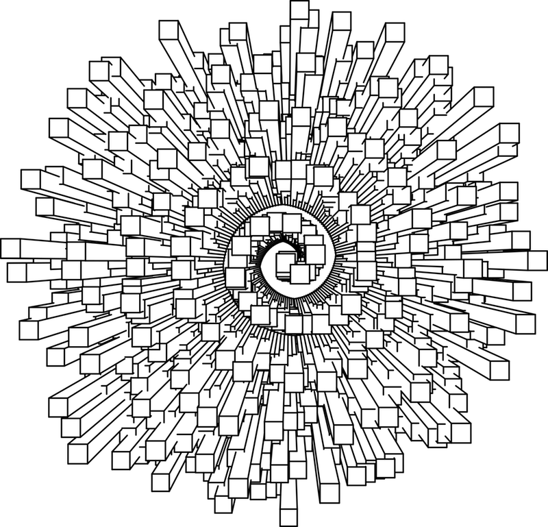
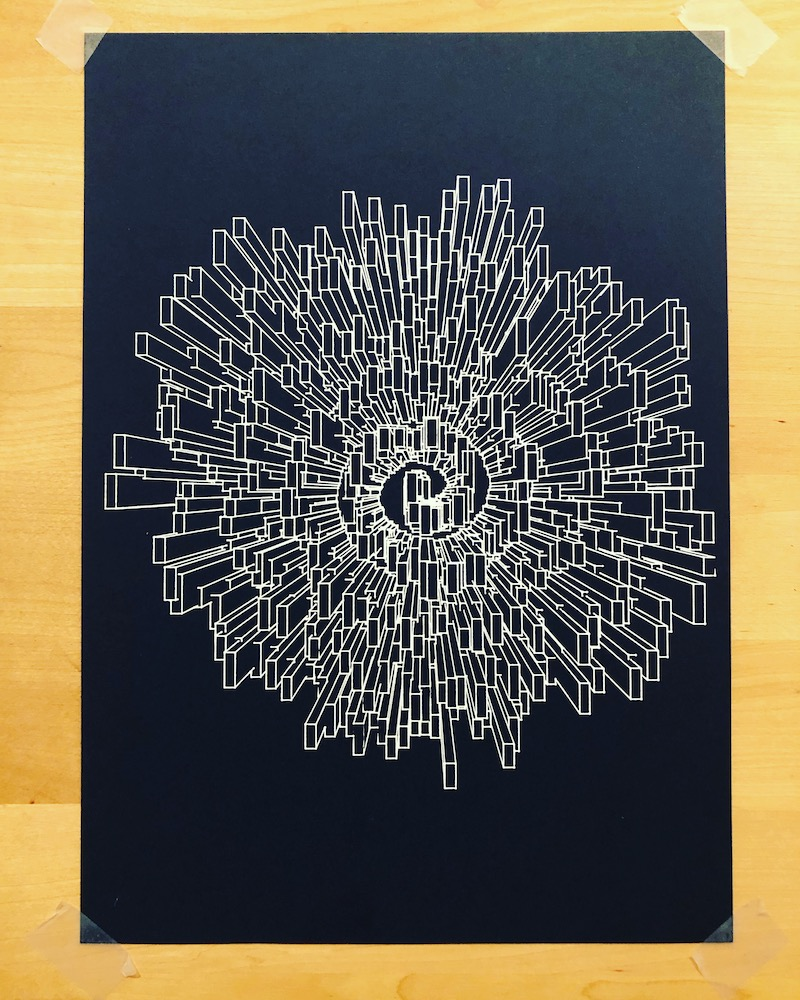

# p5.js + ln 👉 svg 👉 axidraw 🤩

Quick an dirty code composition of : 

* [p5.js](https://p5js.org/) v0.4.8
* [p5.js-svg](https://github.com/zenozeng/p5.js-svg)
* [ln](https://github.com/fogleman/ln) aka "3D Line Art Engine" by [Michael Fogleman](https://www.michaelfogleman.com/) adapted for javascript by [Reinder Nijhoff](https://reindernijhoff.net/) for the wonderful [Turtletoy](https://turtletoy.net/) 

